# 🍅 Pomodoro - Focus Tracker

## 📝 Description

Pomodoro is a React Native mobile application designed to help you track your focus time and manage your tasks. With a built-in task manager, you can easily create, edit, and delete tasks and track your progress using the Pomodoro technique. The Pomodoro technique involves working for a set amount of time, usually 25 minutes, followed by a short break, usually 5 minutes. This app allows you to customize the length of your focus and break sessions and store this data using AsyncStorage. The app also features animations and sound effects to enhance the user experience. Moreover, Pomodoro is fully scalable to different device sizes, including iPads.

## 📷 Screenshots

Few screenshots of the app:

  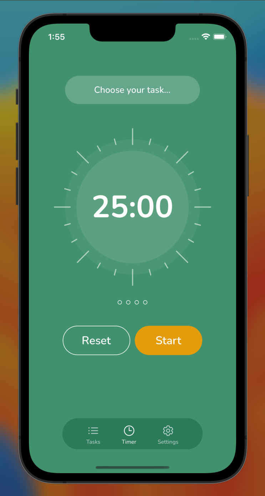
  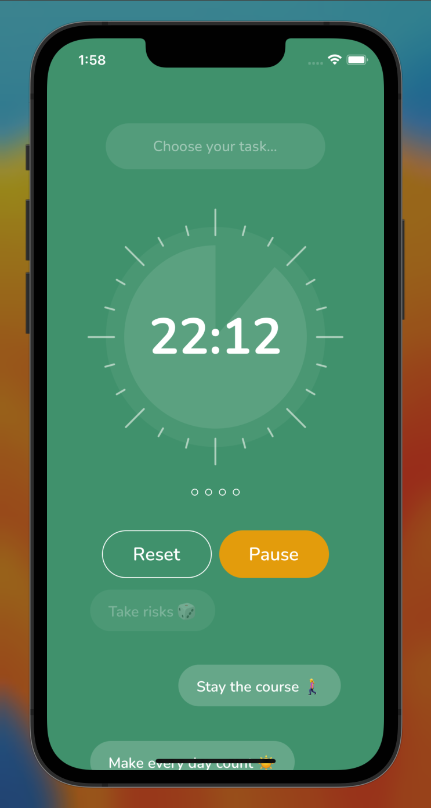
  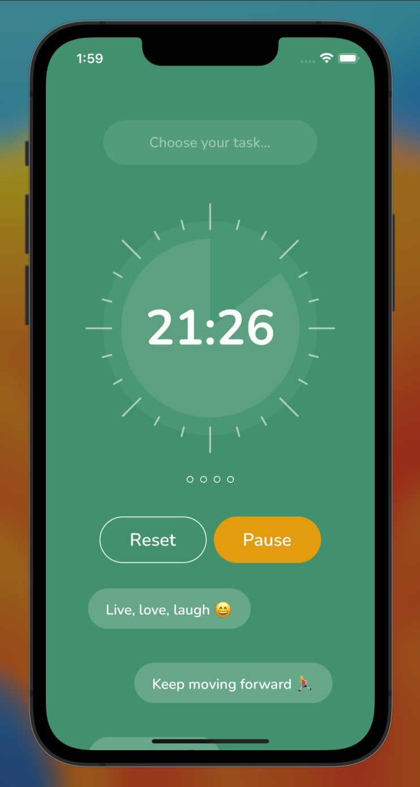

  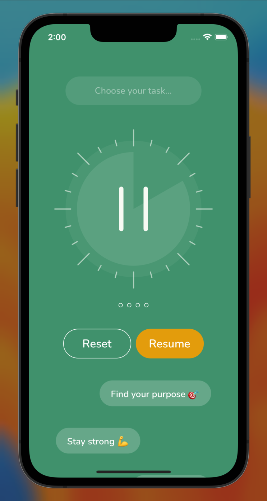
  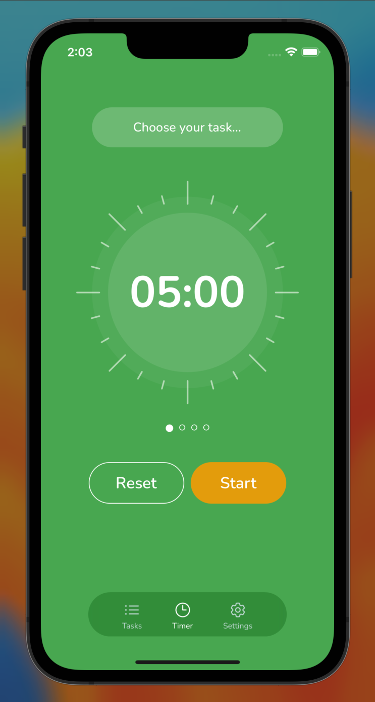
  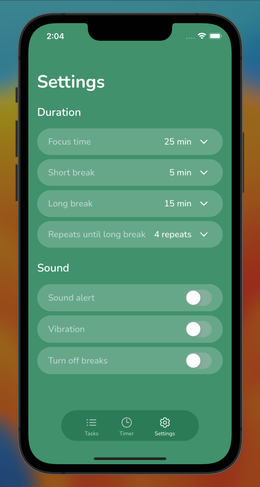

  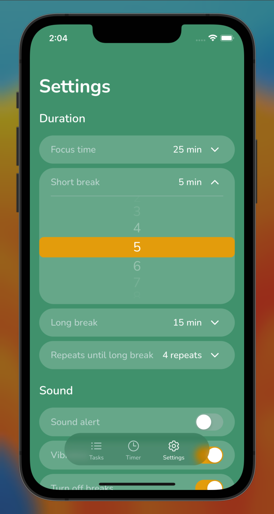
  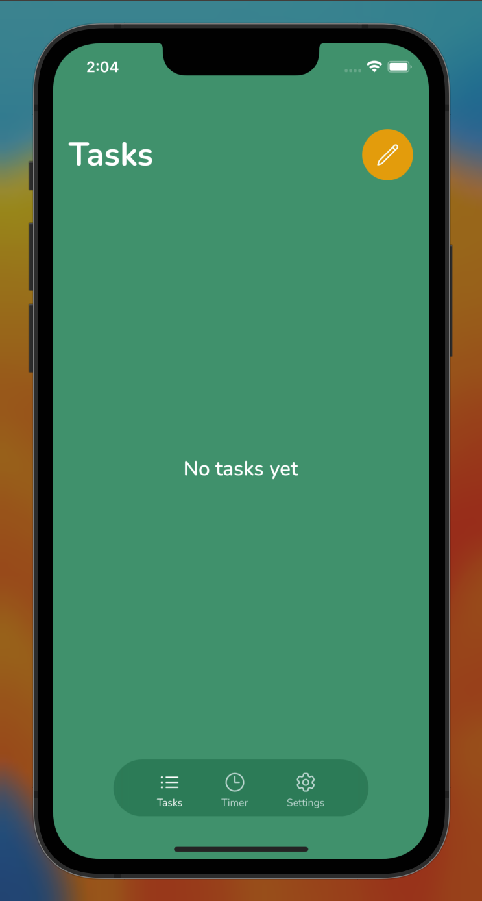
  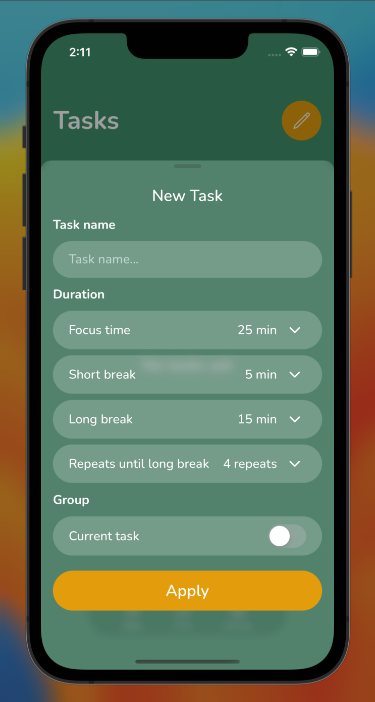

  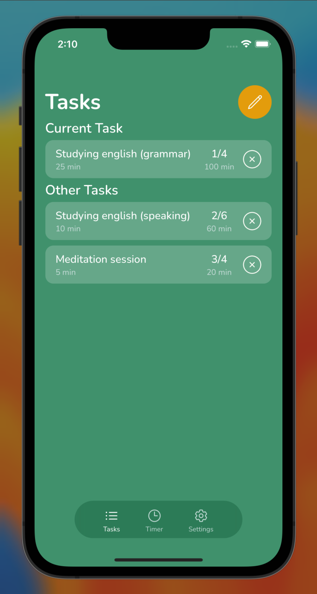
  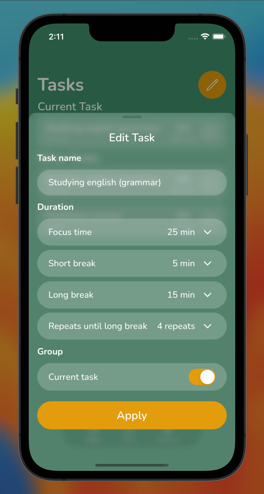
  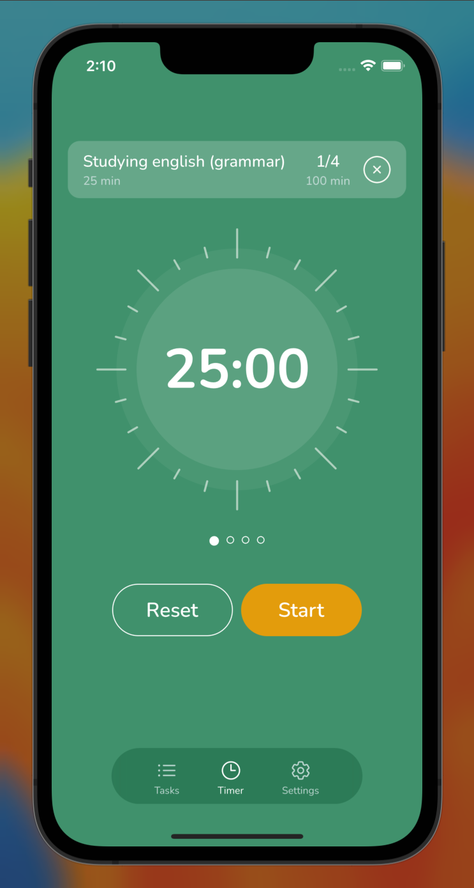

## 🎥 Pomodoro App Demo

Here are some short demo videos of my Pomodoro app in action:

##### Starting a new session, pausing, resuming, and resetting the session.

https://user-images.githubusercontent.com/20643582/229542453-14f64580-8fe5-4e43-8a29-37f79bd5b956.mov

##### Completing a first Pomodoro.

https://user-images.githubusercontent.com/20643582/229542924-3653007a-0d0e-485e-b2bd-48e348adc609.mov

##### Changing app settings.

https://user-images.githubusercontent.com/20643582/229542952-724f3df6-0e1e-4356-bc4f-cdc42d8f71fd.mov

##### Adding new tasks and editing existing tasks.

https://user-images.githubusercontent.com/20643582/229542990-f4f211c8-558e-4235-84af-d4e1bc4b27af.mov

## 🛠️ Installation

To install and run the app locally, follow these steps:

1. Clone this repository.
2. Install [Node.js](https://nodejs.org/) if you haven't already.
3. Install and configure [React Native CLI](https://reactnative.dev/docs/environment-setup) if you haven't already.
4. Install project dependencies by running `yarn`.
5. Install pods `cd ios && pod install && cd ..`.
6. Run `npx run ios` to launch the app on your emulator or device.

## 🎉 Features

Pomodoro has the following features:

- Pomodoro timer using the Pomodoro technique ⏱️
- Built-in task manager for creating, editing, and deleting tasks 📝
- Ability to customize and save different focus and break session lengths ⚙️
- Storing and retrieving data using AsyncStorage 📦
- Animations 🎬
- Fully scalable to larger and smaller devices 📱💻

## 🚀 Technologies Used

Pomodoro was built using the following technologies:

- [React Native](https://reactnative.dev/): A JavaScript framework for building mobile applications for iOS and Android.
- [TypeScript](https://www.typescriptlang.org/): A statically typed superset of JavaScript that compiles to plain JavaScript.
- [Redux Toolkit](https://redux-toolkit.js.org/): A package that simplifies the process of creating and managing a Redux store.
- [React Navigation](https://reactnavigation.org/): A library for implementing navigation in React Native apps.
- [Async Storage](https://react-native-async-storage.github.io/async-storage/): A key-value storage system for storing data in React Native apps.
- [React Native Reanimated](https://docs.swmansion.com/react-native-reanimated/): A library that provides a way to create high-performance animations in React Native apps.
- [React Native Sound](https://github.com/zmxv/react-native-sound): A library for playing sound in React Native apps.
- [React Native Redash](https://wcandillon.gitbook.io/redash/): A set of utility functions for creating complex and performant animations in React Native apps.
- [UUID](https://www.npmjs.com/package/uuid): A library for generating unique identifiers.
- [ESLint](https://eslint.org/): A tool for identifying and reporting on patterns found in JavaScript code.
- [Prettier](https://prettier.io/): A code formatter that enforces a consistent style across a project.

## 🙏 Contributing

If you'd like to contribute to this project, please follow these steps:

1. Fork this repository.
2. Create a new branch for your feature or bug fix.
3. Make your changes and commit them with descriptive commit messages.
4. Push your changes to your forked repository.
5. Submit a pull request to this repository with a description of your changes. 🙌

Thank you for your interest in contributing to this project! 🤝
